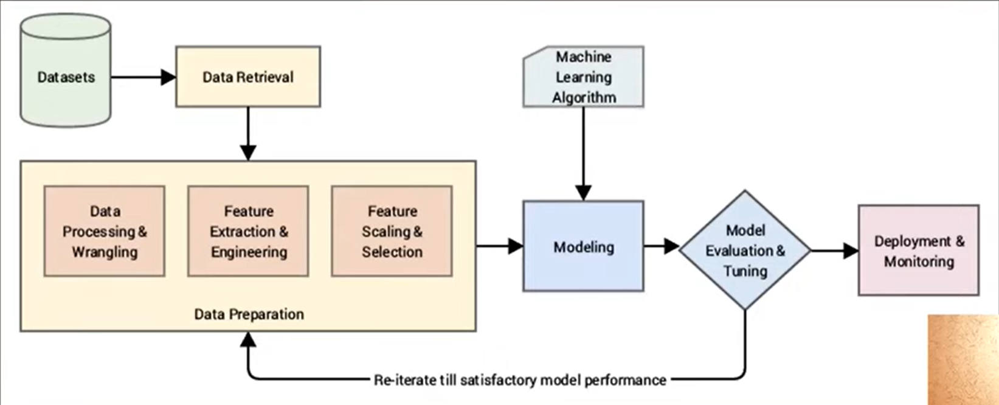
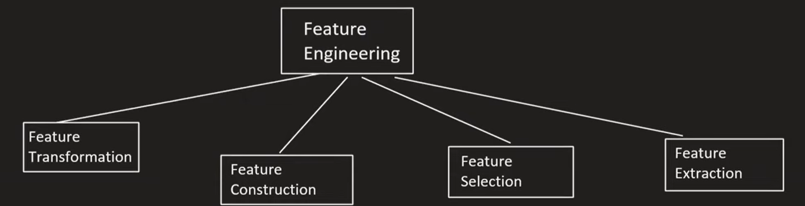

# Day 23

## [What is Feature Engineering](https://www.youtube.com/watch?v=sluoVhT0ehg&list=PLKnIA16_Rmvbr7zKYQuBfsVkjoLcJgxHH&index=23)

Feature engineering is the process of using domain knowledge to extract features from eaw data. These features can be used to improve the performance of machine learning algorithms.

### Parts of Feature Engineering

#### Steps of Feature Transformation
- Missing Value Imputation
- Handling Categorical Features
- Outlier Detection
- Feature Scaling