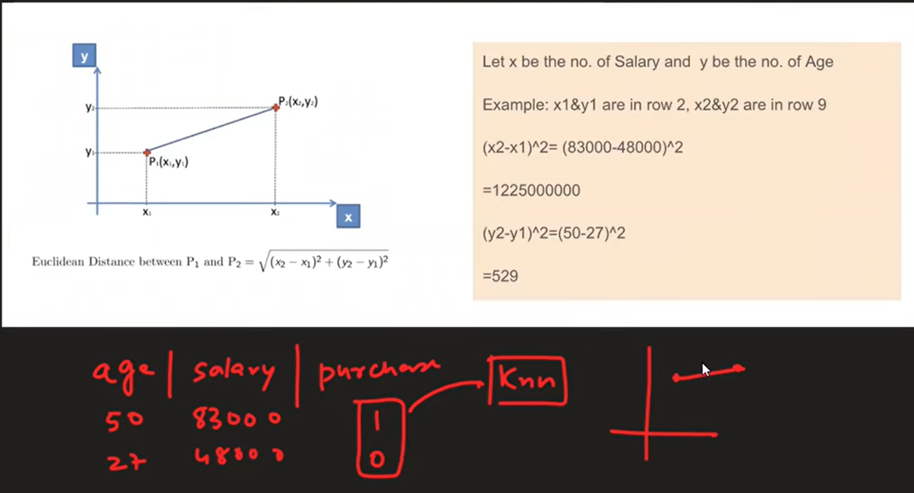

# Day 24

## [Feature Scaling](https://www.youtube.com/watch?v=1Yw9sC0PNwY&list=PLKnIA16_Rmvbr7zKYQuBfsVkjoLcJgxHH&index=24) 

It is a technique to standardize the independent feature present in the data in a fixed range

### Why do we need Feature Scaling?

More Demonstration in the Notebook

### Types of Feature Scaling:
- Standardization (using Normal Distribution)
- [Normalization](../Day%2025/index.md)
    - Min Max Scaling
    - Robust Scaling
    .
    .

### Effect on Outlier: No Effect

### When to use Standardization? 
- K-Means
- K-N-N
- PCA (Principal Component Analysis)
- ANN
- Gradient Descent

### Notebook: [Feature Scaling](./Code/index.ipynb)