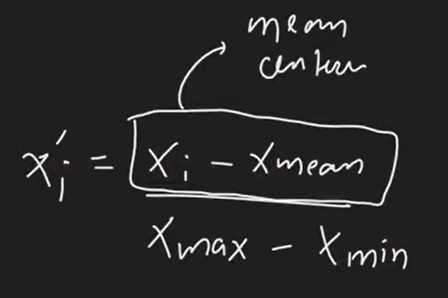
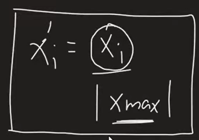
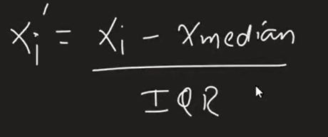

# Day 25

## [Normalization](https://www.youtube.com/watch?v=eBrGyuA2MIg&list=PLKnIA16_Rmvbr7zKYQuBfsVkjoLcJgxHH&index=25)

Normalization is a technique often applied as a part of data preparation for machine learning. The goal of normalization is to change the values of numeric columns in the dataset to use a common scale, without distorting differences in the ranges of values or losing information

### Types:
- Min Max Scaling
- Mean Normalization
- Max Absolute Scaling
- Robust Scaling

### Notebook : [Min Max Normalization](./Code/index.ipynb)

### Mean Normalization
Useful for centered data. Standardization is somewhat same but not completely same

Dont have its corresponding function in sklearn.

### Max Absolute Normalization
It is useful in case of Sparse Data

In skLearn -> MaxAbsScaler()

### Robust Normalization
If data has lot of outliers it is very useful.

In skLearn -> RobustScaler()

### Normalization vs Standardization
<!-- Watch Video -->
Most of the time Standardization is used.